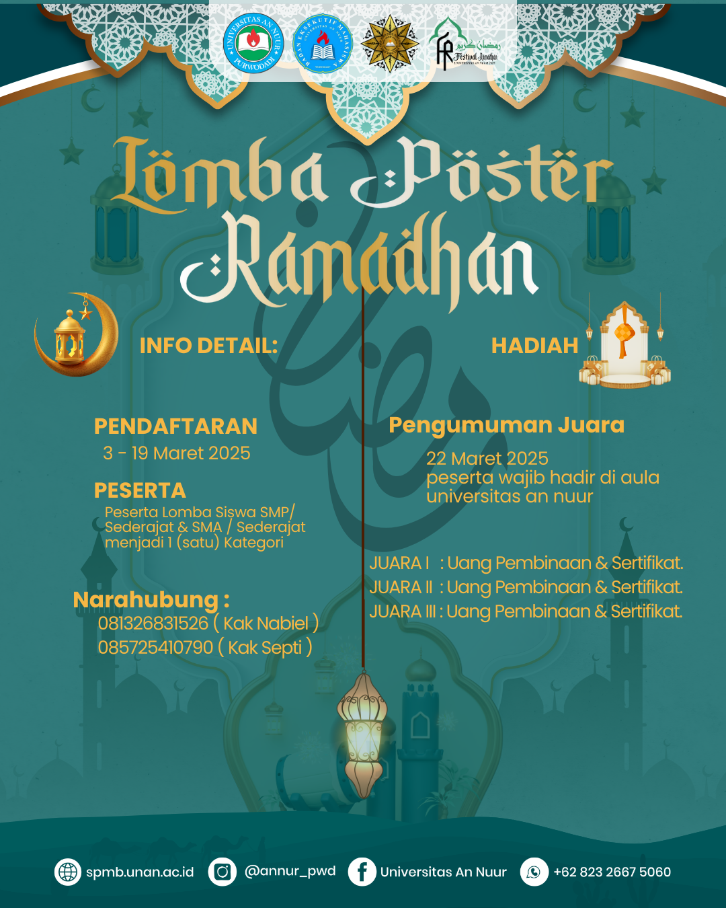

<!DOCTYPE html>
<html lang="id">
<head>
    <meta charset="UTF-8">
    <meta name="viewport" content="width=device-width, initial-scale=1.0">
    <title>Lomba Desain Festival Ramadhan 2025</title>
    <link rel="stylesheet" href="https://cdnjs.cloudflare.com/ajax/libs/font-awesome/6.0.0/css/all.min.css">
    <link href="https://cdn.jsdelivr.net/npm/bootstrap@5.3.0/dist/css/bootstrap.min.css" rel="stylesheet">
    <link href="https://fonts.googleapis.com/css2?family=Poppins:wght@300;400;600&display=swap" rel="stylesheet">
    
    
    
</head>
<body>
    <nav class="navbar navbar-expand-lg navbar-dark">
        

            <a class="navbar-brand" href="#">Lomba Desain Ramadhan</a>
        

    </nav>
    

        

            
        

        <h2>📢 Tentang Lomba</h2>
        <!-- 
Lomba desain poster ini bertujuan untuk mengembangkan kreativitas siswa dalam menyambut bulan suci Ramadhan dengan sentuhan digital.
 -->
         <h2></h2>
        

            
            <!-- 
Gunakan template ini sebagai referensi dalam membuat desain poster.
 -->
        

        <h2>🗓 Jadwal Lomba</h2>
        

            
<strong>Pendaftaran:</strong> 1 - 19 Maret 2025

            
<strong>Penilaian:</strong> 20 Maret 2025

            
<strong>Pengumuman Pemenang:</strong> 21 Maret 2025

            
<strong>Penyerahan Hadiah & Pameran:</strong> 21 Maret 2025

            
<strong>Catatan:</strong> Semua Peserta Wajib Hadir Pada 21 Maret 2025 pukul 12.00 WIB

        

        
      
        
        <!-- <h2>🖼 Galeri Karya Peserta</h2>
        

            
            
            
        
 -->
        
        <h2>📄 Dokumen Lomba</h2>
        

            <a class="btn btn-custom" href="https://drive.google.com/file/d/1ESOxBMC3QsXIHw2ScCnI73bPZT1cj_cS/view?usp=sharing">📑 Panduan Lomba</a>
            <a class="btn btn-custom" href="https://forms.gle/SK97UHtRsTY88Ydt9">📝 Formulir Pendaftaran</a>
            <!-- <a class="btn btn-custom" href="#">📜 Surat Pernyataan Keaslian Karya</a> -->
        

    

    
    <footer class="mt-4 p-3 text-center bg-dark">
        <h2>📞 Hubungi Kami</h2>
        
📩 Email: <a href="mailto:bemunan20242025@gmail.com" class="text-light">bemunanp20242025@gmail.com</a>

        <!-- 
📱 Instagram: <a href="https://instagram.com/universitasannuur" class="text-light">@annur_pwd</a>
 -->
        
📱 Instagram: <a href="https://instagram.com/bemunanpurwodadi" class="text-light">@bemunanpurwodadi</a>

        
🌐 Website: <a href="https://www.unan.ac.id" class="text-light">www.unan.ac.id</a>

    </footer>
</body>
</html>
